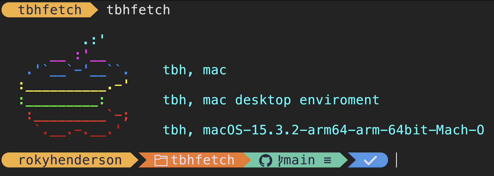
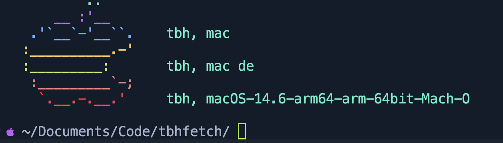
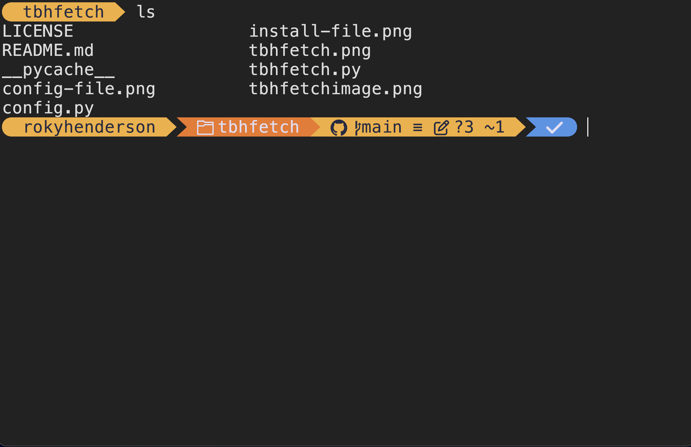
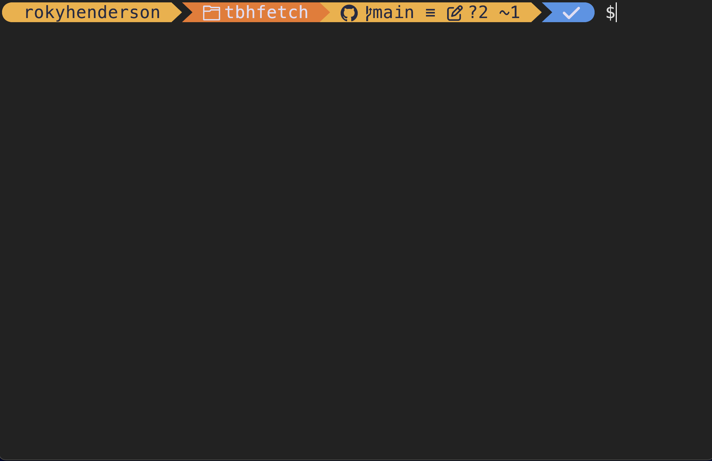
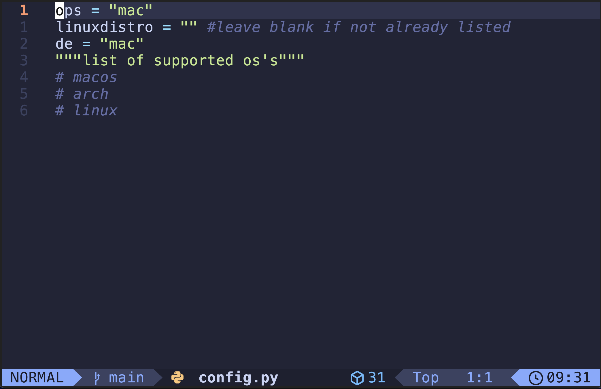

<h2>tbhfetch 🐍</h2>

|

|

###

A <a href="https://www.python.org/">Python</a> based <code>fetch</code> program for people who enjoy beautiful things.

###

<code>tbhfetch</code> needs to be manually configured to display the right info. All its code is open source on <code>github</code> as you can see here.

###

<h2>requirements ✅</h2>

Bash (<a href="https://www.gnu.org/software/bash/">bash website.</a>)

#####
Zsh (<a href="https://www.zsh.org/">zsh website.</a>)

#####
Python <u>3</u> (<a href="https://www.python.org/">python3 website.</a>)

#####
Git - to install - (<a href="https://git-scm.com/">git website.</a>)

###

<h2>install 💻</h2>

Copy The following into your terminal
<pre>
git clone https://github.com/rhhen122/tbhfetch ~/tbhfetch
cd ~/tbhfetch/
rm -f config-file.png
rm -f install-file.png
rm -f requriements-file.png
rm -f tbhfetch.png
rm -f tbhfetchimage.png
</pre>

###

<h2>config 📝</h2>

To begin config use <code>vim</code> or <code>nvim</code> to open the <code>config.py</code>. or if your lazy run the following
<pre>
cd ~/tbhfetch
nano config.py
</pre>
change it to either:
 - mac
 - arch
 - linux
if you chose linux type your distro in the <code>linuxdistro</code> variable.

###
> [!NOTE]
> kde is the only currently suppoted DE anything else will deafault to its text.

